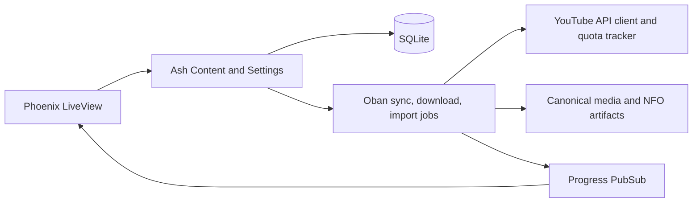

Phoenix LiveView presents channel, queue, and settings state. Ash domains coordinate Content and Settings state in SQLite. Oban runs metadata synchronization, downloads, imports, and media-permission work; progress returns through PubSub for the live UI.

## YouTube metadata flow

The YouTube client uses Req-facing API calls and coordinates pagination, batches, incremental checks, and stored content through the Content domain. Channel and monitored-playlist work can run in background sync jobs. Batch and sync operations check the quota tracker before work. The provider's actual quota policy is authoritative; Ytdarr's fixed-offset local accounting is operational bookkeeping, not a provider guarantee.

## Media flow

A user manually queues a known video. The download worker invokes yt-dlp and constructs canonical media artifacts; imports follow a separate recoverable path for an existing host-visible file. Generated NFO and file layout support TV-library scans, while an import conflict preserves a recovery path rather than overwriting a destination.

Read the source modules when changing behavior: `lib/ytdarr/content`, `lib/ytdarr/settings`, `lib/ytdarr/services/youtube`, `lib/ytdarr/oban_workers`, and `lib/ytdarr/media`. Keep public documentation aligned with observed behavior rather than an intended optimization or UI label.